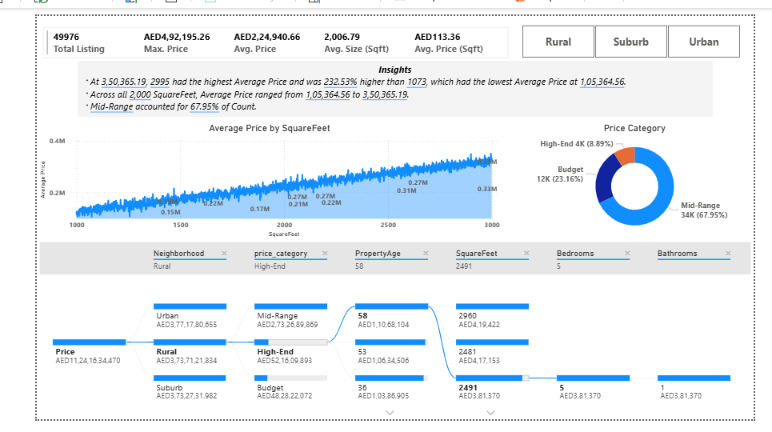

# 📊 Dubai Housing Price Analysis

This project was completed as part of my **Labmentix Internship**, where I performed end-to-end data analysis on Dubai housing data using **MySQL and Power BI**.

---

## 📌 Project Overview

The objective of this project is to analyze housing prices in Dubai by cleaning raw data, transforming it into meaningful features, and building an interactive dashboard to extract actionable insights.

This project demonstrates:
- Data cleaning using SQL  
- Data transformation and feature engineering  
- Data visualization using Power BI  
- Business insight generation  

---

## 🛠 Tools & Technologies

- **MySQL** → Data cleaning and preprocessing  
- **Power BI** → Dashboard creation and visualization  
- **DAX** → Creating dynamic measures and KPIs  

---

## 📂 Dataset Description

The dataset includes the following features:

- **SquareFeet** → Size of the property (in sqft)  
- **Bedrooms** → Number of bedrooms  
- **Bathrooms** → Number of bathrooms  
- **Neighborhood** → Area type (Rural, Suburb, Urban)  
- **YearBuilt** → Year of construction  
- **Price** → Property price  

---

## 🧹 Data Cleaning & Transformation (MySQL)

The following preprocessing steps were performed:

- Removed invalid and unrealistic price values  
- Created a new column `price_category`  
- Classified properties into:
  - Budget  
  - Mid-Range  
  - High-End  

---

## 📊 Power BI Dashboard

An interactive dashboard was created to visualize and analyze housing data.

### 🔹 Key Features:
- KPI Cards (Total Listings, Average Price, Average Size, Price per Sqft)  
- Price vs Square Feet Trend Analysis  
- Price Category Distribution  
- Decomposition Tree for detailed breakdown  
- Interactive filters based on location  

---

## 📐 DAX Measures

Some key measures used in the dashboard:

- Total Listings  
- Average Price  
- Average Size  
- Average Price per Sqft  

These measures dynamically update based on user selections and filters.

---

## 📈 Key Insights

- Mid-range properties dominate the market (~68% of listings)  
- Property prices increase proportionally with size (square feet)  
- Urban areas contribute the highest total property value  
- Most properties have 3–5 bedrooms, indicating family-oriented demand  
- The market shows stable and predictable pricing trends  

---

## 💡 Business Recommendations

- Focus on **mid-range properties** for maximum demand  
- Invest in **urban locations** for higher returns  
- Target **1500–2500 sqft homes** for balanced pricing and demand  
- Explore opportunities in the **budget segment**  

---

## 📁 Project Structure

Dubai-Housing-Price-Analysis/
│
├── dataset/
├── sql/
├── powerbi/
├── report/
├── images/
└── README.md

---

## 🖼 Dashboard Preview

---

## 🚀 Conclusion

This project showcases practical implementation of data analysis using SQL and Power BI.  
It highlights how raw data can be transformed into meaningful insights that support decision-making in the real estate domain.
